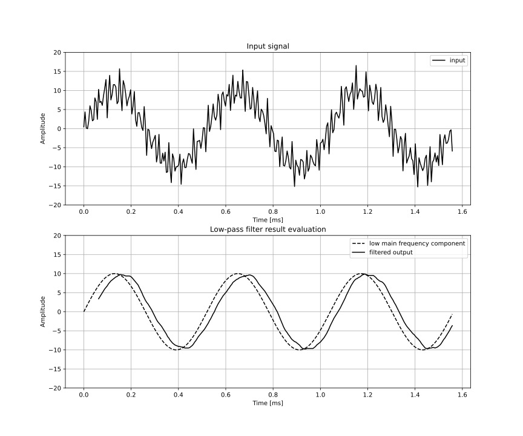

# VHDL Implementation of a FIR filter (Management and Analysis of Physical Datasets mod. A)

## Authors

- [Eugenio Fella](https://github.com/eugeniofella)
- [Chiara Maccani](https://github.com/chiaramaccani)
- [Pietro Miglioranza](https://github.com/pmiglioranza)
- [Carlo Sgorlon Gaiatto](https://github.com/carlosgorlongaiato)

## Summary

A moving average filter is a common causal finite impulse response filter used in digital signal processing. It can be built through a simple and very fast algorithm, which makes it suitable for many different applications. The main objective of this work is the design of the architecture of a moving average filter using VHDL and its implementation on an FPGA. In particular, we have applied the filter in a cascade to approach the effect of a low-pass filter and analyzed the latency introduced by the cascade itself.

    
    

Then we have tested it on a multi-frequency sinusoidal signal with noise background and we have compared the results with a python simulation.

Since the FPGA uses a UART for serial communications that handles only 8 bit signed integers, we had to properly pre-process the input signal. The error introduced by this process along with the internal division approximation of the filter have been discussed. In the end, we have also briefly analyzed the latency and the resource utilization of the presented implementation.
